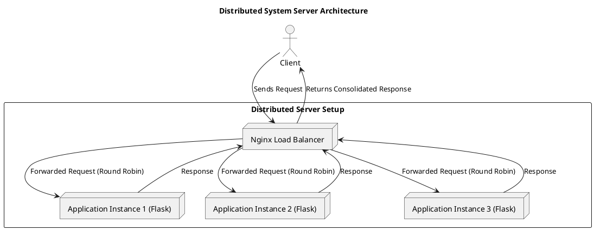

# 🖥️ Distributed System Server Configuration Project

## 📘 Overview

This project demonstrates the **configuration and functioning of a distributed system server** using modern containerization and load balancing techniques.  
It showcases how multiple application instances can efficiently share workloads, maintain fault tolerance, and scale dynamically in a distributed environment.  

The implementation uses:
- **Docker** for containerization  
- **Nginx** for load balancing  
- **Flask (Python)** for the backend service  

---

## 🧩 Architecture

The system is designed using a **microservice-style distributed architecture**.

### **Architecture Summary**
1. **Client:** Sends requests to the load balancer.  
2. **Load Balancer (Nginx):** Distributes requests evenly among backend application containers using a round-robin policy.  
3. **Backend Services (Flask Apps):** Multiple instances of a lightweight Flask server run independently, serving client requests concurrently.  
4. **Containerization (Docker):** Ensures isolated, reproducible environments for each service.  

### **PlantUML Diagram**


---

## ⚙️ Project Structure

```
distributed-system-server/
│
├── docker-compose.yml         # Compose file for multi-container setup
├── nginx.conf                 # Nginx load balancer configuration
├── app/
│   ├── Dockerfile             # Dockerfile for Flask application
│   └── app.py                 # Python backend service
│
├── docs/
│   ├── Project_Report.pdf     # Project report (optional)
│   ├── distributed_system_results_chart.png  # Result chart
│   └── architecture_diagram.puml             # PlantUML diagram
│
└── .gitignore
```

---

## 🚀 Setup Instructions

### **1️⃣ Prerequisites**
Make sure you have:
- [Docker Desktop](https://www.docker.com/products/docker-desktop/) installed  
- [Git](https://git-scm.com/) installed  

### **2️⃣ Clone the Repository**
```bash
git clone https://github.com/<your-username>/distributed-system-server.git
cd distributed-system-server
```

### **3️⃣ Build and Start the Distributed System**
```bash
docker-compose up --build
```

This command:
- Builds three Flask app containers (`app1`, `app2`, `app3`)
- Starts an **Nginx** container to balance requests

### **4️⃣ Test the Setup**
Open your browser or use `curl` to send multiple requests:
```bash
curl http://localhost:8080/
```

You will see alternating responses such as:
```
Hello from app1
Hello from app2
Hello from app3
```

This confirms **load balancing** is working properly.

---

## 📊 Result Summary

| **Test Case** | **Condition** | **Requests Handled per Instance** | **Observation** |
|----------------|----------------|-----------------------------------|-----------------|
| **1** | Normal operation | Equal distribution (4 each) | Load distributed evenly (Round Robin). |
| **2** | app2 stopped | app1 – 6, app3 – 6 | Fault tolerance validated (no downtime). |
| **3** | app4 added | app1–3, app2–3, app3–3, app4–3 | Dynamic scalability achieved. |

The results show that the configured distributed system:
- Distributes workload evenly across instances  
- Automatically adapts to node failure  
- Scales horizontally with minimal configuration  

---

## 🧰 Tools and Technologies

| Category | Tool |
|-----------|------|
| Programming Language | Python (Flask) |
| Containerization | Docker |
| Load Balancer | Nginx |
| Visualization | Matplotlib (for analysis) |
| Documentation | PlantUML, Markdown |

---

## 🧪 How to Stop the Containers
To stop the system:
```bash
docker-compose down
```

To rebuild everything from scratch:
```bash
docker-compose up --build --force-recreate
```

---

## 📖 References

1. A. S. Tanenbaum and M. Van Steen, *Distributed Systems: Principles and Paradigms*, 2nd ed., Prentice Hall, 2007.  
2. M. Kleppmann, *Designing Data-Intensive Applications*, O’Reilly Media, 2017.  
3. Docker Documentation – [https://docs.docker.com/](https://docs.docker.com/)  
4. NGINX Load Balancing Guide – [https://docs.nginx.com/nginx/admin-guide/load-balancer/](https://docs.nginx.com/nginx/admin-guide/load-balancer/)  
5. Kubernetes Documentation – [https://kubernetes.io/docs/concepts/](https://kubernetes.io/docs/concepts/)  

---

## 🏁 Conclusion

This project successfully demonstrates the setup and configuration of a distributed system server using open-source technologies.  
It highlights how **containerization and load balancing** can improve system scalability, fault tolerance, and reliability.  
The approach serves as a foundation for extending into **Kubernetes orchestration**, **cloud deployment**, or **microservice architectures** in future work.

---

*Author: [Your Name]*  
*Date: October 2025*
